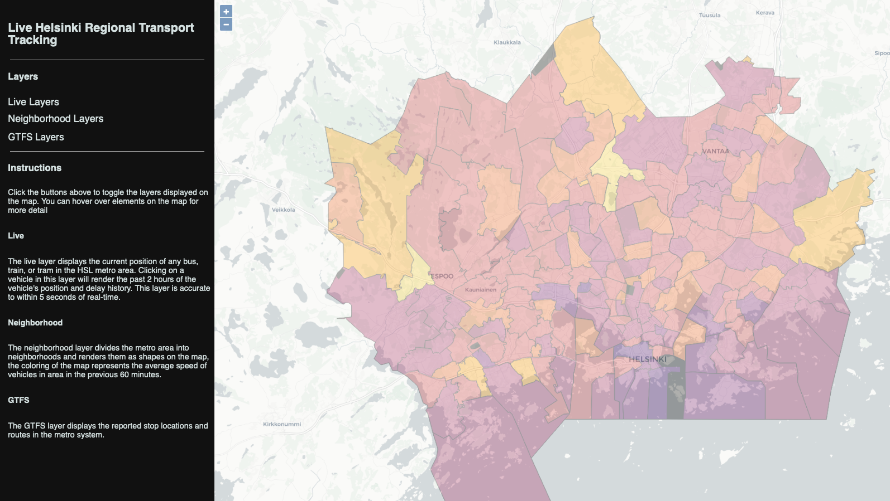
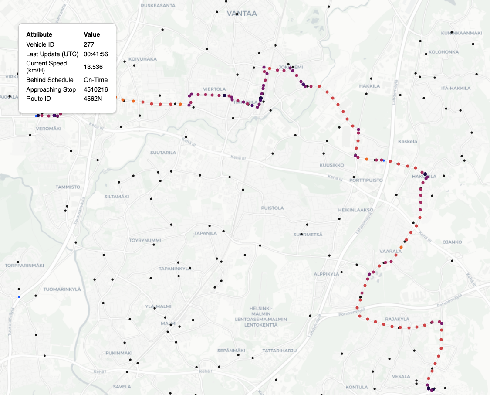
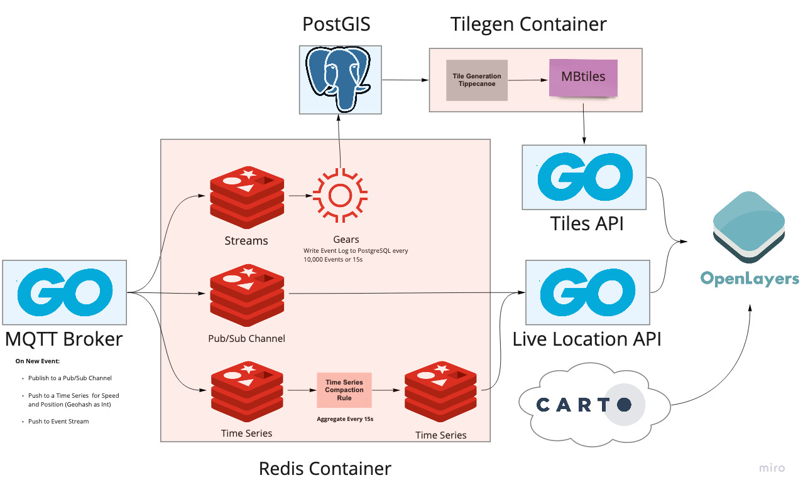

# MQTT -> Redis

This project uses Redis to publish live locations of vehicles in the Helsinki metro area. Data is sourced from the Helsinki Regional Transit Authority's public data feeds via MQTT. Messages are processed through a broker written in Golang and into Redis. 

From Redis, the data is fanned out to a stream, a pub/sub channel, and multiple time series.

The stream data is occasionally marshalled into PostgreSQL using a Redis Gears function. This data is re-processed hourly and used to generate MapBox tiles that indicate relative traffic levels displayed on the front-end.

The pub/sub channel is consumed by a Golang API which pushes messages along to each connected client via websocket. This allows for live updates of positions in the browser.

The time series data is split into a series for position and speed for each "trip", compacted into standardized series every 15s, and then served to the frontend by a Golang API.

The remainder of this document will go through the local deployment of the application in a bit more detail.

------

## Images

### Screenshot of Live Map - Downtown Helsinki


### Screenshot of Live Map - Neighborhoods



### Screenshot of Live Map - History of Single Vehicle



------

## Startup Notes

A functional version of the system can be spun up locally with `docker-compose up --build`. This will spin up (almost) all services required to run a local demo.

```bash
docker-compose up --build
```

The following command should be run if you're interested in receiving periodic updates to the traffic speeds/neighborhoods layer. This command allows for the periodic updates of the Neighborhood layers, this is recommended, but is not strictly necessary.

```bash
docker exec redis_hackathon_redis_1 \
    bash -c "gears-cli run /redis/stream_writebehind.py --requirements /redis/requirements.txt"
```

------

## Architecture Diagram



------

## System Architecture

### MQTT Broker

The MQTT broker is a Golang service that subscribes to a MQTT feed provided by the Helsinki Transit Authority and pushes message data to Redis. More about the real time positioning data from the HSL Metro can be found [here](https://digitransit.fi/en/developers/apis/4-realtime-api/vehicle-positions/).

The broker is responsible for writing an incoming message from the MQTT feed to each of the following locations:

#### PubSub Channel

The incoming event is pushed to a pub/sub channel in Redis. This service uses Golang as a redis client and uses the command below:

```golang
pipe := client.TxPipeline()
ctx := client.Context()

// Stylizing the Actual Message Body for Readme
msg := &hsl.EventHolder{
    "acc": 0.1, "speed": 10.6, "route": "foo"
}

pipe.Publish(
    ctx, "currentLocationsPS", msg
)
```

Using a standard Redis client, this is the same as:

```bash
127.0.0.1:6379>  PUBLISH currentLocationsPS '{"acc": 0.1, "speed": 10.6, "route": "foo"}'
```

#### Stream

The incoming event is pushed to a stream. This stream is later processed by code that runs via Redis Gears. As with the PUB/SUB channel, this is written using the Redis Go Client shown below.

```golang
pipe.XAdd(
    ctx, &redis.XAddArgs{
        Stream: "events",
        Values: []interface{}{
            "jid", journeyID,
            "lat", e.VP.Lat,
            "lng", e.VP.Lng,
            "time", e.VP.Timestamp,
            "spd", e.VP.Spd,
            "acc", e.VP.Acc,
            "dl", e.VP.DeltaToSchedule,
        },
    },
)
```

Using the Redis CLI, this would be equivalent to 

```bash
127.0.0.1:6379>  XADD events * jid journeyhashID lat 60 lng 25 time 1620533624765 speed 10 acc 0.1 dl "00:00"
```

#### TimeSeries

The incoming event is pushed to several time series. A unique identifier is created for each "trip" (referred to as **JourneyHash**) by combining and hashing certain attributes from the event. The broker creates a time series for both speed and position for each journeyhash. Location data is stored in a time series by encoding (lat, lng) position from the event and encoding it to an integer representation of a geohash. Speed is simply stored as m/s, as it appears in the original MQTT message.

The position and speed series have a short retention and are compacted to secondary time series. These compacted series have a much longer retention time (~2hr) and are used by the API. This also allows us to keep memory usage much lower.

##### TimeSeries Commands

As with previous sections, the commands are executed by Golang. As the standard Golang client does not include the `TS.XXX` commands, I will forgo showing the exact Go written for this section. First, I check to see if a journeyhash is new by checking it's inclusion in a set. If the following returns `1`, I proceed with creating series and rules, else, I just `TS.ADD` the data.

```bash
SADD journeyID <JOURNEYHASH>
```

The first series is created with the following command. For the remainder of this section, I'll refer to these as **Time Series A**

```bash
127.0.0.1:6379>  TS.CREATE positions:<JOURNEYHASH>:speed
127.0.0.1:6379>  TS.CREATE positions:<JOURNEYHASH>:gh
```

The aggregation series are fed by the "main" timeseries and created with the command below. I'll refer to these as **Time Series B**

```bash
127.0.0.1:6379>  TS.CREATE positions:<JOURNEYHASH>:speed:agg RETENTION 7200000 LABELS speed 1 journey <JOURNEYHASH>
127.0.0.1:6379>  TS.CREATE positions:<JOURNEYHASH>:gh:agg RETENTION 7200000 LABELS gh 1 journey <JOURNEYHASH>
```

For the rule that governs **Time Series A** -> **Time Series B**, I use the following command:

```bash
127.0.0.1:6379> TS.CREATERULE positions:<JOURNEYHASH>:speed positions:<JOURNEYHASH>:speed:agg AGGREGATION LAST 150000
127.0.0.1:6379> TS.CREATERULE positions:<JOURNEYHASH>:gh positions:<JOURNEYHASH>:gh:agg AGGREGATION LAST 150000
```

To add data to **Time Series A** I use the following:

```bash
127.0.0.1:6379> TS.ADD positions:<JOURNEYHASH>:speed * 10 RETENTION 60000 CHUNK_SIZE 16 ON_DUPLICATE LAST
127.0.0.1:6379> TS.ADD positions:<JOURNEYHASH>:gh * 123456123456163 RETENTION 60000 ON_DUPLICATE LAST
```

In the example above, `123456123456163` is a fake number which represents a integer encoding of a geohash. lat,lng -> int encoding was handled in Go with [this](https://pkg.go.dev/github.com/mmcloughlin/geohash@v0.10.0) package.

Note the use of `ON DUPLICATE LAST`, this is because occasionally messages will come from in bursts over the wire. For example, imagine a vehicle leaving a tunnel and publishing the past 5 minutes (~150 messages) at once. Even w. millisecond precision, there may be some collisions.


### Redis

I use a docker image that is based on `redislabs/redismod:latest`. I pre-install pip to smooth the process of running gears-cli calls in the container.

The container also contains a Gears function. When triggered, the function implements a write-behind pattern, consuming from a stream and writing data to PostgreSQL/PostGIS every 5s/10,000 events. Even though Gears runs off the main thread, this function is designed to do the minimal data-processing. This function simply dumps MQTT event data into PostGIS and allows the PostGIS and TileGen Containers to transform it to MBtiles.

The Gears function is written in Python and doesn't call any Redis commands, it's just a streamReader, reading from the `events` stream defined in the section above.

```python
sreader = GearsBuilder(
    "StreamReader",
    defaultArg="events",
    desc=json.dumps(
        {
            "name": "events.StreamReader",
            "desc": "Read from the all events stream and write to DB table",
        }
    ),
)
```

### PostGIS

PostGIS is a PostgreSQL extension that enables geospatial operations. Static GTFS data is downloaded into PostGIS so that it can be later used to create the `routes` , `areas`, and `stops` layers. The PostGIS database is also the target of the Redis Gears function.

### TileGen

TileGen is an alpine container that contains two common utilities used in geospatial processing, `GDAL` and `tippecanoe` (and `psql`, the PostgreSQL client). This container is required for:

1. Sourcing static data and pushing it to PostGIS with `GDAL` (`./get_static_data.sh`)
2. Periodic regeneration of tiles using `tippecanoe` (`./tilegen.sh`)

You can read more about these two projects here:

- [GDAL](https://gdal.org/)
- [Tippecanoe](https://github.com/mapbox/tippecanoe)

### Tiles API

After TileGen has run, it produces a series of Mapbox Tiles saved on disk. The TilesAPI is a very simple Golang API which is used to fetch those tiles from disk and send them to the frontend.

### Locations API

The Locations API has two endpoints `/locations/` and `/histlocations/`.

- `/locations/` subscribes to the Redis PUB/SUB channel that we publish incoming events to. When a client connects to this endpoint, the connection is upgraded and events are pushed along to the client in real-time.
  
- `/histlocations/` queries the trip timeseries in redis using `MRANGE`, the API takes the "merged" response and creates a response of historical positions and speeds for a given trip.

#### Locations API Commands

The `/locations/` endpoint subscribes/reads data from the PUB/SUB channel defined in the MQTT broker section. Technically, this is written in Go, the redis-cli command for this would be:

```bash
127.0.0.1:6379> SUBSCRIBE currentLocationsPS
```

The `/histlocations/` endpoint needs to gather data from multiple time series to create a combined response for the client, this means making a `TS.MRANGE` call. Because each **Timeseries B** is labelled with it's journey hash, the `TS.MRANGE` gathers the position and speed stats with a single call, filtering on journey hash.

```bash
127.0.0.1:6379> TS.MRANGE  - + FILTER journey=<JOURNEYHASH>
```

The endpoint contains the business logic in golang to turn this into a nice JSON response body.

### Frontend

The frontend uses [OpenLayers](https://openlayers.org/), a JS library, to create a map and display the layers created by the previously described services. 

- The GTFS Layer comes from the Tiles API
- The Live Layer comes from the Locations API
- The base map images come from calling a publicly available [Carto API](https://carto.com/help/building-maps/basemap-list/)